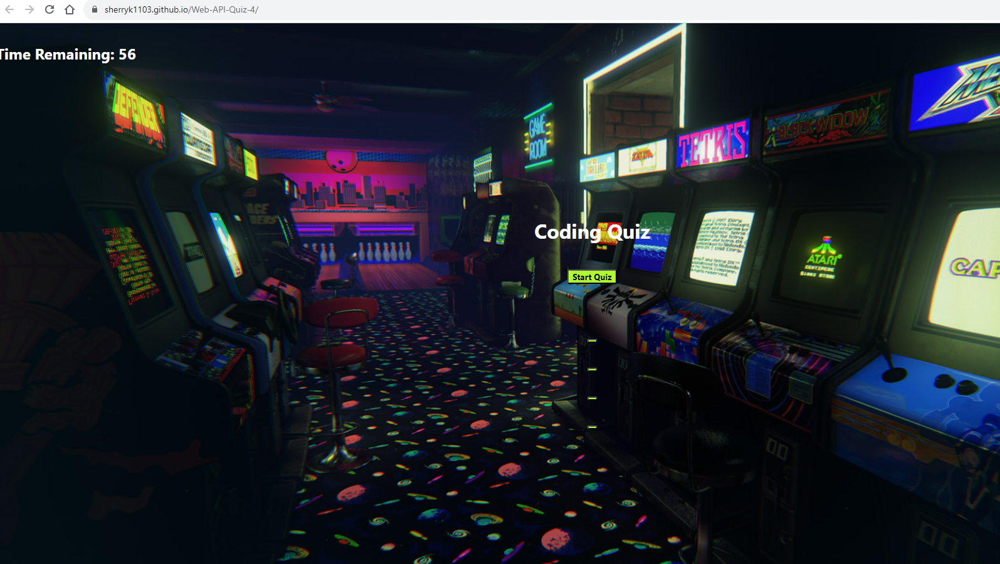

# Web-API-Quiz-4

## Description

I wanted to create a web application that quizzes the user on coding facts to test their knowledge and sharpen their skills.

## Installation

To install code, run the following command:
Git clone <paste SSH key>

## Deployed Link

https://sherryk1103.github.io/Web-API-Quiz-4/

## Usage

## Process Steps

1. Created an HTML file in VS code and implemented the basic HTML boiler plate starter code
2. Created a headers and HTMLs elements to coincide with JavaScript code
3. Created a JavaScript file that contains all JS functions linked to HTML document
